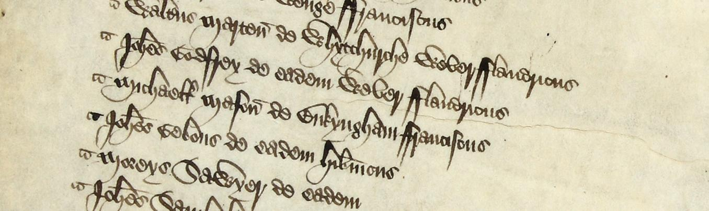

# England’s Immigrants 1330-1550

[][image]

_Sample of an alien tax assessment, taken in Buckinghamshire for the subsidy granted in 1440_ ([source and info][image])

<!-- badges: start -->
<!-- badges: end -->

[image]: https://www.englandsimmigrants.com/page/archive/images

## Summary

This dataset provides 64,783 names of people who immigrated to England in the Middle Ages, giving insight into their destinations, places of origin, occupations, wealth, households, identities and lifespans.

## The Project

_England’s Immigrants 1330-1550_

> is a major research project funded by the
[Arts and Humanities Research Council](https://www.ahrc.ac.uk/),
which ran between February 2012 and February 2015.

The collaboration involved the [University of York](https://www.york.ac.uk/), [The National Archives](http://www.nationalarchives.gov.uk/) and the [Humanities Research Institute, University of Sheffield](http://www.sheffield.ac.uk/hri).

I recommend that, before using the data, at a minimum you read [the background to the research project][intro] (1,350 words).
The project explores

> the extensive archival evidence about the names, origins, occupations and households of a significant number of foreigners who chose to make their lives and livelihoods in England in the era of the Hundred Years War, the Black Death and the Wars of the Roses. [_source_][intro]

The project is far more than just the dataset available in this repo.
For example, the [team][project team] has compiled [detailed and entertaining stories][project stories] of some of the people who came to England.


## Origins of the data

The data available is largely drawn from tax records:

> From 1440, a series of specific taxes, known as the ‘alien subsidies’, were levied upon first-generation immigrants resident in most parts of England, and the returns for these provide a vast amount of information regarding their names, places of residence, origins, occupations and gender.
In the following century, the revolutionary new subsidies levied by the Tudor monarchs also contained provisions for the taxation of resident aliens, and their records can also provide similarly useful insights into the immigrant populations of particular areas. [_source_][intro]

### Limitations and caveats

> The database provides a complete list of all the evidence from the sources we have used, but remember that there are two crucial limitations to this data.
The first is that we have only used the two most important types of evidence available for the period:
[alien subsidy returns][asr] and [letters of denization][letters],
but not other types of evidence such as local records.
The second is that the records we have used are themselves often incomplete.
[_source_][sources]

> As the database records the instances of contact with immigrants over the period, rather than the individual, there may be multiple records of the same immigrant.
Therefore, it is possible to track an immigrant’s location and wealth through time by using surviving tax returns for subsequent years...
In many cases it is impossible to distinguish between records of one immigrant with the same name as another forty years later.
In order not to distort the original records, it is the searcher’s responsibility to use their judgement and interpretation when calculating statistics for the numbers of immigrants, to ensure that some are not being counted twice. [_source_][project help]

Please note that much of the data has already been visualised, and charts and maps are available on the project website.

## Further reading

* Ormrod, W. M. (2020) England's Immigrants, 1330–1550: Aliens in Later Medieval and Early Tudor England, _Journal of British Studies_ 59(2), pp.245–263. [doi: 10.1017/jbr.2019.282][journal]
* [_Becoming English: letters of denization_][becoming-english], Jessica Lutkin _et al._

You are very welcome to submit further relevant articles for inclusion here.

## Project impact

I wanted to note here that [Professor Mark Ormrod][ormrod], the project leader, [died][mo-obit] in August 2020.
This project led Mark

> into collaboration with the Historical Association and the Runnymede Trust, creating new teaching materials for schools, providing training for teachers and contributing to the content of a new national curriculum for schools in History that focused on the long history of migration to Britain.
One output of this work, '[Our Migration Story][oms]', to which his research contributed, won the Guardian award for Research Impact in 2019.

## Why?

I originally discovered this data through Jeremy Singer-Vine's [_Data is Plural_ newsletter, 19th August 2020][jsv].

I'm personally interested in the data because of the way it

> contributes creatively to the longer-term history of immigration to England, and helps to provide a deep historical and cultural context. [_source_][intro]

Preliminary work for the project suggests that the presence of 'resident aliens' in England in 1440 approached

> 1% of the total population, and perhaps as high as 6% in London[...] comparable with levels of immigration still being reported in the 1901 UK census.

Wow! This suggests that

> a remarkably large proportion of late-medieval English society must have had at least some direct human contact with non-native people, a situation which poses... questions regarding the attitudes and reactions of the native population towards the foreigners living within their communities...

### Disclaimer

I (francisbarton) have no connection with the _England's Immigrants_ project nor any member of the project team.
I just thought the dataset sounded interesting and wanted to make it more easily available for `R` users (and possibly as a [#TidyTuesday][tt] challenge).

[intro]: https://www.englandsimmigrants.com/page
[project team]: https://www.englandsimmigrants.com/page/archive/personnel
[project stories]: https://www.englandsimmigrants.com/page/individual-studies
[project help]: https://www.englandsimmigrants.com/help
[asr]: https://www.englandsimmigrants.com/page/sources/alien-subsidies/
[letters]: https://www.englandsimmigrants.com/page/sources/letters-of-denization-and-other-sources
[sources]: https://www.englandsimmigrants.com/page/sources
[journal]: https://www.cambridge.org/core/journals/journal-of-british-studies/article/englands-immigrants-13301550-aliens-in-later-medieval-and-early-tudor-england/18763980AF6911AD8DEA4B5D27984007
[bbn]: https://theconversation.com/brexit-to-bonfire-night-why-the-reformation-still-matters-86330
[becoming-english]: https://www.ourmigrationstory.org.uk/oms/becoming-english-letters-of-denization
[ormrod]: https://www.york.ac.uk/history/staff/emeritus-honorary/ormrod/
[mo-obit]: https://www.theguardian.com/education/2020/aug/16/mark-ormrod-obituary
[oms]: https://www.ourmigrationstory.org.uk/
[jsv]: https://tinyletter.com/data-is-plural/letters/data-is-plural-2020-08-19-edition
[tt]: https://github.com/rfordatascience/tidytuesday

## Importing and using the data in `R`

Assuming I succeed in making this a valid and installable package, you should be able to grab it and load the data as follows:

```
remotes::install_github("francisbarton/englandsimmigrants")
```
then
```
library(englandsimmigrants)

data(immigrants_orig) # raw data - see data-raw/immigrants_orig.R
data(immigrants)      # tidied data - see R/immigrants_tidy.R
```
or
```
englandsimmigrants::immigrants
```


## Support

### Getting help with this package

Thanks for using England's Immigrants.
Before filing an issue, there are a few places to explore and pieces to put together to make the process as smooth as possible.

### Make a reprex

Start by making a minimal **repr**oducible **ex**ample using the  [reprex](https://reprex.tidyverse.org/) package. 
If you haven't heard of or used reprex before, you're in for a treat! 
Seriously, reprex will make all of your R-question-asking endeavours easier (which is a pretty insane ROI for the five to ten minutes it'll take you to learn what it's all about).
For additional reprex pointers, check out the [Get help!](https://www.tidyverse.org/help/) section of the tidyverse site.

### Where to ask?

Armed with your reprex, the next step is to figure out [where to ask](https://www.tidyverse.org/help/#where-to-ask). 

*   If it's a question: start with [community.rstudio.com](https://community.rstudio.com/), and/or StackOverflow. There are more people there to answer questions.
*   If it's a bug: you're in the right place, [file an issue](https://github.com//issues/new).
*   If you're not sure: let the community help you figure it out! 
    If your problem _is_ a bug or a feature request, you can easily return here and report it.

Before opening a new issue, be sure to [search issues and pull requests](https://github.com//issues) to make sure the bug hasn't been reported and/or already fixed in the development version. 
By default, the search will be pre-populated with `is:issue is:open`. 
You can [edit the qualifiers](https://help.github.com/articles/searching-issues-and-pull-requests/)  (e.g. `is:pr`, `is:closed`) as needed. 
For example, you'd simply remove `is:open` to search _all_ issues in the repo, open or closed.

